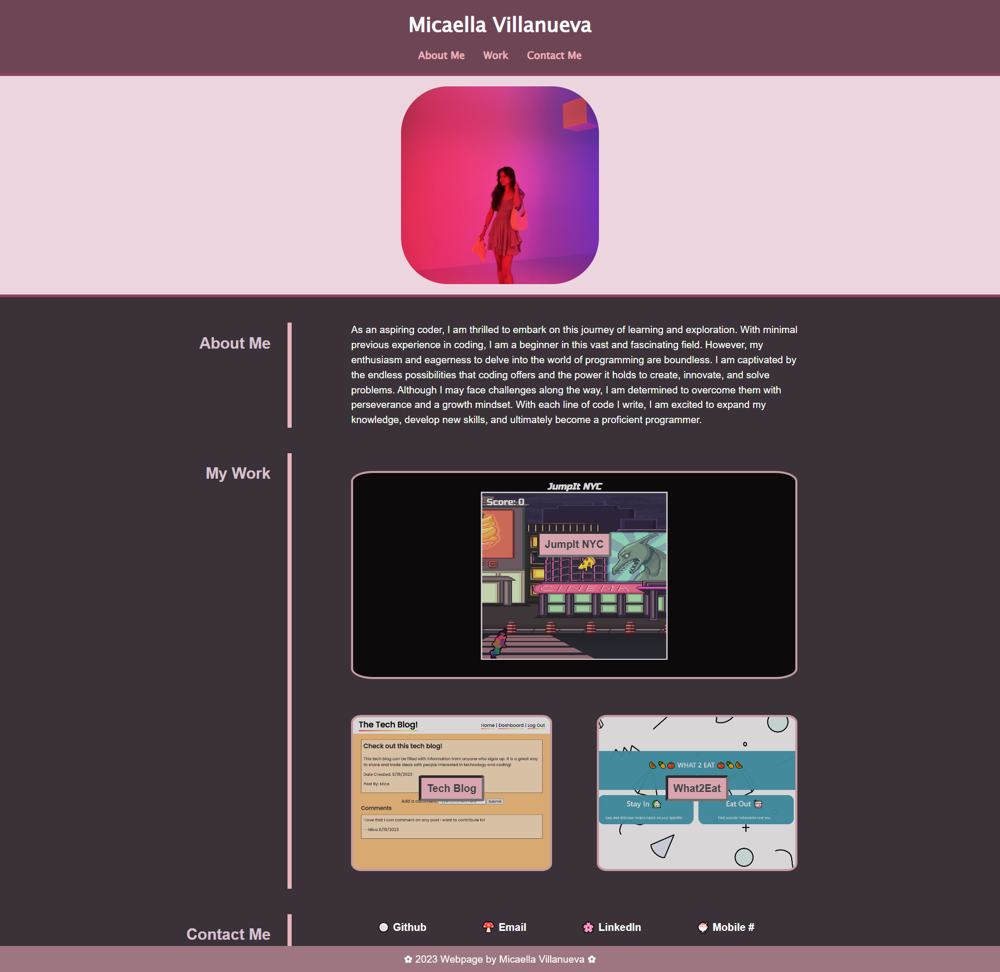

# Micaella-Portfolio

## Description
Starting from scratch, this webpage was created to showcase the knowledge and skills I've learned thus far in the full-stack web development bootcamp. The webpage begins with my name and a navigation bar from which a user can quickly access the corresponding sections. An image and an 'About Me' section are displayed to give employers an initial impression of myself. Then, my technical skills are further expressed through the 'My Work' section in which my deployed applications are linked. Employers can click on the work items to see the active pages in a new tab and inspect my HTML and CSS. Finally, my contact information is included at the bottom in case any employers would like to reach out directly to me. This webpage is accessible on various devices and differing screen widths.

## Credit
A huge shoutout to my classmate, Dahlia Guido, for allowing me to mirror her HTML and CSS structure for the main content. These structures were applied to my main HTML tag and CSS for classes 'content', 'title', and 'sub-content' (comments added pointing to these aforementioned lines of code). Dahlia's Github profile: https://github.com/CypherNyx

## Usage

https://micavilla.github.io/micaella-portfolio/